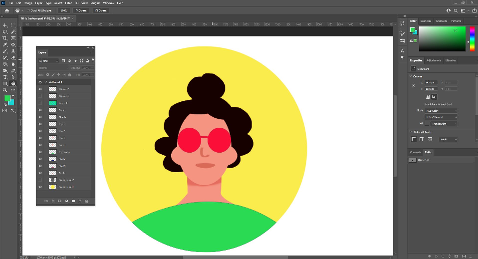

# Project 3: Auction Market Place for NFTs
 
## Table of Contents
* [Description](#description)
* [Goals](#project-goals)
* [Data Collection and Preparation](#data-collection-and-preparation)
* [Development and Technologies](#development-and-technologies)
* [Instructions](#instructions)
* [Video Demo](#video-demo)
* [Contributors](#contributors)
* [References and Resources](#references-and-resources)

## Description
---
In this project, we aim to create an NFT marketplace for the auction of digital assets using smart contracts and solidity.

## Goals
---
In recent years, there has been an ever increasing interest in NFTs - As an example, one NFT which was just an image of a column written in New York Times sold for $560,000 in a matter of days. Observing such keen interest in the demand and sale of NFTs as well as the expanding market for digital assets, we felt it would be a great idea to launch our very own T-GRAM Auction Marketplace. 

T-GRAM's goal is to support local and emerging artists and provide them a fast and efficient platform to register their work and sell them through an Auction based marketplace allowing them to connect with collectors all over the world (decentralized network).

Our NFT auction marketplace provides:
* A platform that connects artists and collectors through blockchain technology with complete transparency. It holds asset/token/deed that is to be auctioned using the ERC standards (ERC721 Ownership by smart contract)
* Ability to place bids in auctions, over a decentralized network with following functions and features:
        - ability to participate in an auction based upon the English Auction whereby bid prices keep increasing over the duration of the auction.
        - ability to monitor the auction process (start bid, bid price, highest bidder etc.)
        - ability to view the frequency of each bidder
        - ensuring transfer of NFT ownership upon auction completion
        - ensuring safe and accurate transfer of funds upon auction completion
        - Refund of funds to bidders that did not get not lucky
* Use of Polygon Network provided the users with a method that is lower in cost and more efficient as compared to transacting directly over the Ethereum Network (Proof of Stake vs Proof of Work benefits)
* Works with digital assests stored over an established and secure file storage system (ipfs - Pinata)
* T-GRAM does not charge or retain any of the profits from these sales hence providing a free of cost platform for the artists. As opposed to OpenSea, who charge a chunky one-time registration fee to list each NFTs as well as recurring fees

## Data Collection and Preparation
---

In order to test and demo our application we need to have an inventory of digital artwork. We created some custom ones using Photoshop. In order to generate the IPFS links for the custom artwork, we utilized Pinata. 

 

## Development and Technologies
---

Our NFT marketplace is build using the following technologies: 
* Solidity (smart contracts)
* Remix IDE
* Streamlit (front-end)
* MetaMask (wallet)
* Decentralized Blockchain Network (Polygon TestNet)
* Xbox GameBar/Quicktime Player (Demo Video)
* Chainlink (new technology/library - not covered in class)
* Pinata
* Photoshop
* Python

 
 

## Instructions
---
### Files:
Download the following files to help you get started:

[Auction.sol](./Auction.sol)

[AuctionRegistry.sol](./AuctionRegistry.sol)

### Steps:

To run the application, clone the code from the following GitHub link [git@github.com:tyedem/Project-3.git]. 

1. Step 1: Compile the Auction.sol to ensure it compiles without any errors. 

2. Step 2: Compile the AuctionRegistry.sol to ensure it is completed successfully

3. Step 3: Prior to deployment, ensure your metamask/wallet is connected and the corresponding item (Injected Web3 for Remix IDE) is selected.

4. Step 4: Deploy the Auction.sol and check the deployed contracts to ensure it is there. Copy the address as it would be required for the next step.

5. Step 5: Add the Auction address to the Deploy the AuctionRegistry.sol and proceed to deploy the AuctionRegistry.sol

6. Step 6: Use the Auction address in Auction Registry Deployed Contract in the SetApprovalForAll  to the Deploy the AuctionRegistry.sol and proceed to deploy the AuctionRegistry.sol

TO add Matic: https://faucet.polygon.technology/

## Video Demo
---
[Video Link](./Images/Demo)

## Contributors
---
Project Team

<h2><a href="https://github.com/tyedem"> tyedem</a></h2>

<h2><a href="https://github.com/RiteshChugani"> RiteshChugani</a></h2>

<h2><a href="https://github.com/1ightray"> 1ightray</a></h2>

<h2><a href="https://github.com/atoosa-m"> atoosa-m</a></h2>

<h2><a href="https://github.com/ksmaria"> ksmaria</a></h2>

## References and Resources
---
[NFT Sales](https://www.nytimes.com/2021/03/26/technology/nft-sale.html) 
[Gas-Free NFT IPFS](https://opensea.io/blog/announcements/decentralizing-nft-metadata-on-opensea/) 
[OpenSea Fees](https://support.opensea.io/hc/en-us/articles/1500006315941-What-are-gas-fees-on-Ethereum-) 
[dAPP Auction](https://github.com/sbwengineer/auction-dapp-solidity-vue) 
[What is Polygon?](https://www.wealthsimple.com/en-ca/learn/what-is-polygon?utm_term=&matchtype=&campaign=16685794737&adgroup=138618658447&gclid=CjwKCAjwx46TBhBhEiwArA_DjH4oks3iZWEumuZnRH1iTbVFVlwNUI9OVcZhZeqe6JPyX30xUS4fChoCJxQQAvD_BwE#the_problem_with_ethereum) 
[NFT Auction](https://github.com/techwithtim/Solidity-NFT-Auction) 
[NFT Marketplace](https://betterprogramming.pub/solidity-contracts-for-an-nft-marketplace-5a706bb94486) 

Copyright © 2022# Project-3
